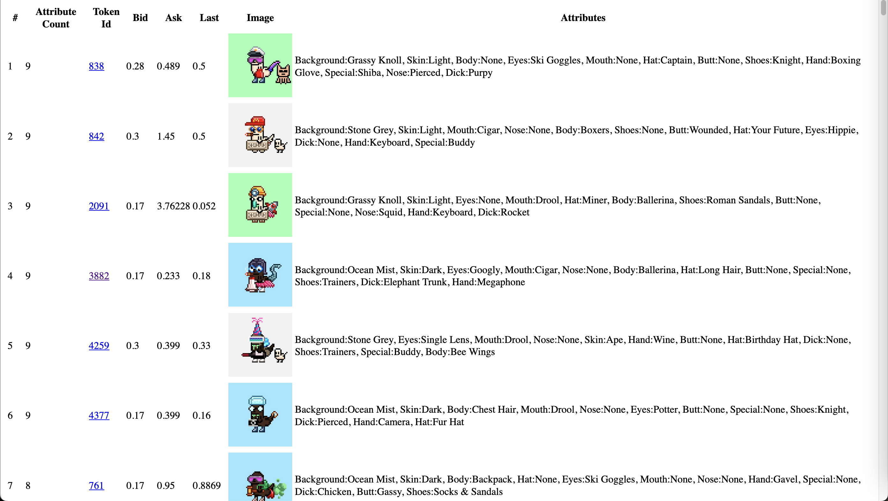

# NFTData
Extract NFT Data. CryptoDickButt Season 3, sorted by attribute count descending in this case.

<kbd></kbd>

<br />

<hr />

Install node-fetch 2.6.6 (later versions require some module configuration):

```
cd scripts
npm install node-fetch@2.6.6

```

Execute [scripts/01_getIt.js](scripts/01_getIt.js) to generate [scripts/tokens.js](scripts/tokens.js):

```
cd scripts
node 01_getIt.js

...
tokenId: 1837, name: CryptoDickbutt #1837, owner: 0xe267f356949c80ab2d98ac444d12e0018324f97e
  attributes: [
  {
    "key": "Background",
    "value": "Ocean Mist"
  },
  {
    "key": "Hat",
    "value": "None"
  },
  {
    "key": "Skin",
    "value": "Mid"
  },
  {
    "key": "Mouth",
    "value": "None"
  },
  {
    "key": "Nose",
    "value": "None"
  },
  {
    "key": "Body",
    "value": "Bikini"
  },
  {
    "key": "Hand",
    "value": "Wine"
  },
  {
    "key": "Butt",
    "value": "None"
  },
  {
    "key": "Eyes",
    "value": "Clout"
  },
  {
    "key": "Dick",
    "value": "None"
  },
  {
    "key": "Special",
    "value": "None"
  },
  {
    "key": "Shoes",
    "value": "Bunny Slippers"
  }
]
Data written to file: tokens.js
```

Execute [scripts/02_reportIt.js](scripts/02_reportIt.js) to generate [scripts/output.html](scripts/output.html). Customise as required

```
$ node 02_reportIt.js
Data written to file: output.html
```
